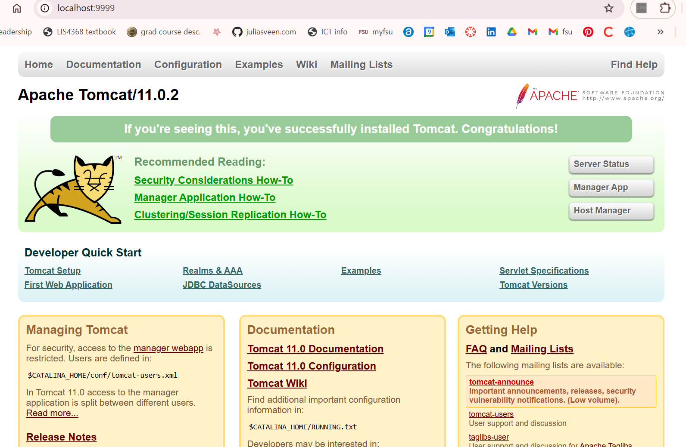
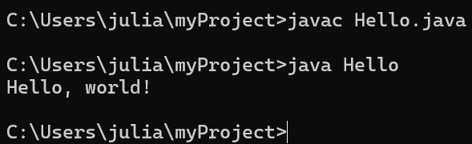
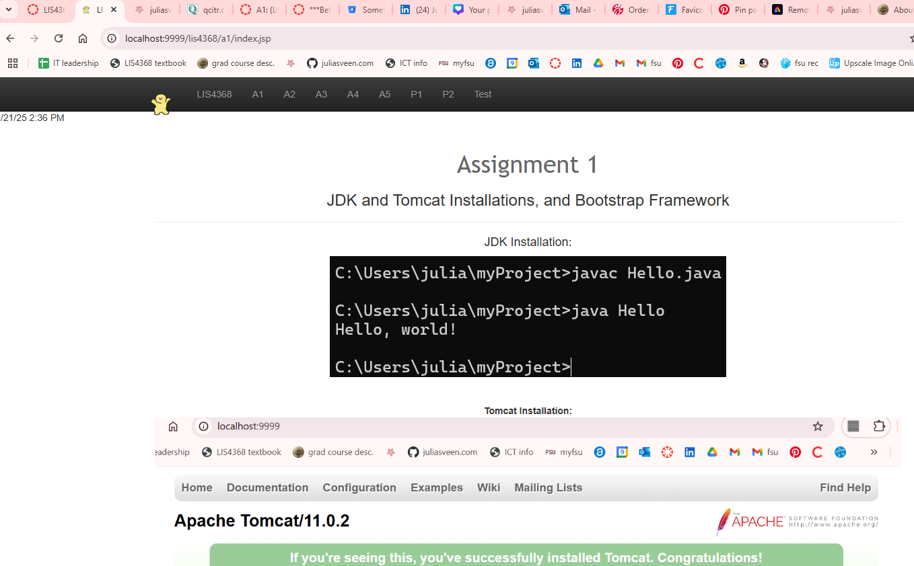

> **NOTE:** This README.md file should be placed at the **root of each of your repos directories.**
>
>Also, this file **must** use Markdown syntax, and provide project documentation as per below--otherwise, points **will** be deducted.
>

# LIS 4368 - Advanced Web Application Development

## Julia Sveen

### Assignment 1 Requirements:

*Sub-Heading:*

1. Distributed version control with Git & BitBucket
2. Development installation
3. Chapter questions 

#### README.md file should include the following items:

* Screenshot of running java Hello
* Screenshot of running localhost:9999
* Screenshot of a1/index.jsp
* Git commands with brief descriptions

> This is a blockquote.
> 
> This is the second paragraph in the blockquote.
>
> #### Git commands w/short descriptions:

1. git init - create an empty git repo or reinitialize existing one
2. git status - display state of working directory
3. git add - add all existing files to index
4. git commit - record changes to repo
5. git push - changes are pushed from local to remote repo
6. git pull - fetch from and integrate with another repo 
7. git log - show commit logs

#### Assignment Screenshots:

*Screenshot of Tomcat running http://localhost*:

*Screenshot of running java Hello*:

*Screenshot of a1/index.jsp*:

#### Tutorial Links:

*Bitbucket Tutorial - Station Locations:*
[A1 Bitbucket Station Locations Tutorial Link](https://bitbucket.org/username/bitbucketstationlocations/ "Bitbucket Station Locations")

*Tutorial: Request to update a teammate's repository:*
[A1 My Team Quotes Tutorial Link](https://bitbucket.org/username/myteamquotes/ "My Team Quotes Tutorial")

