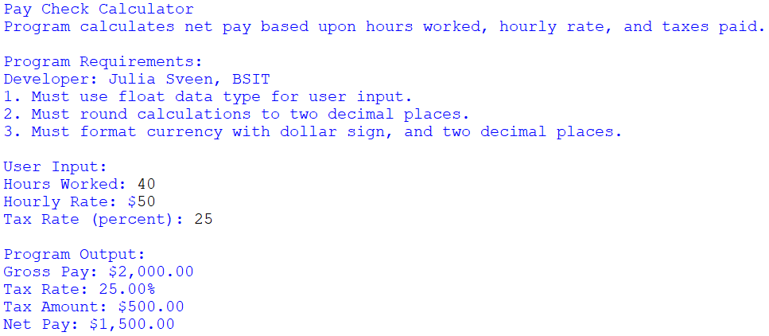
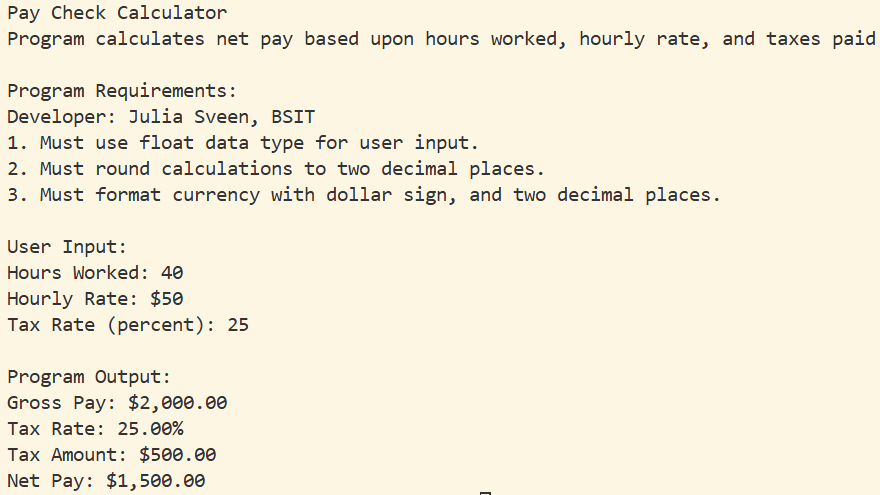
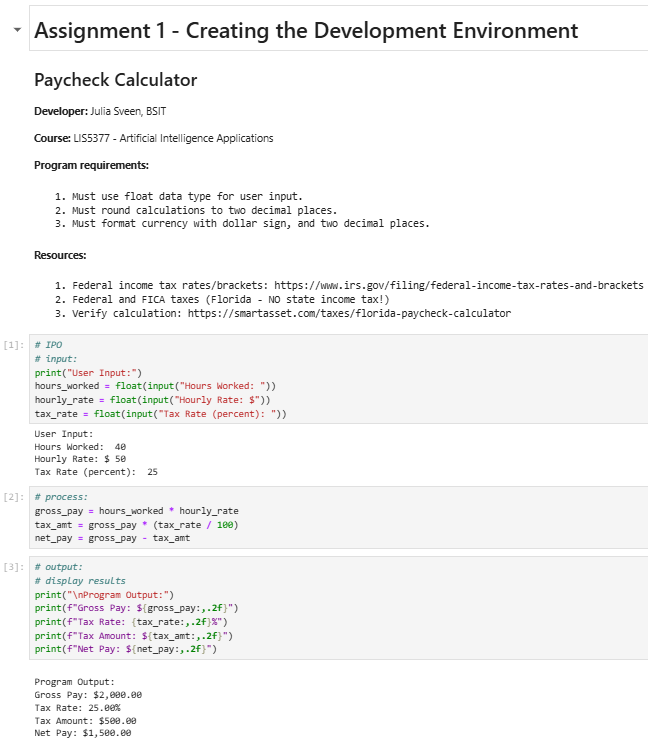
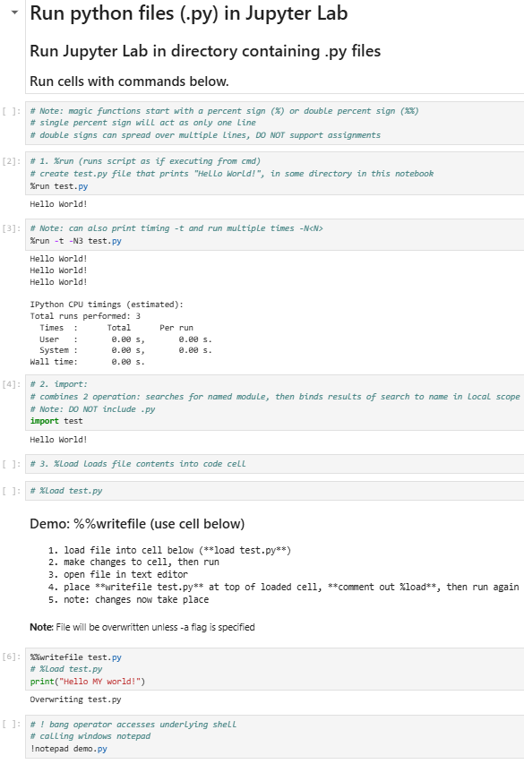
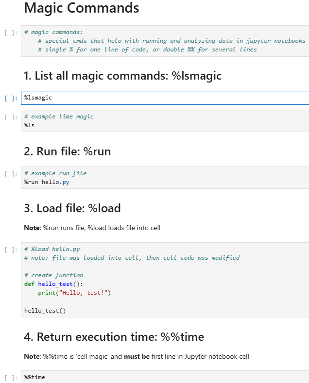
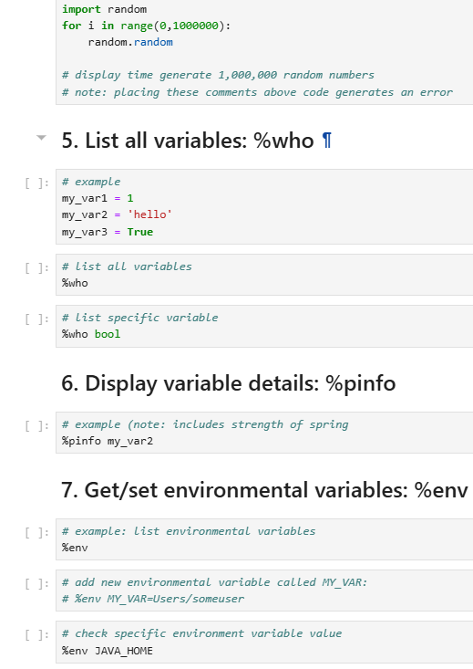

> **NOTE:** This README.md file should be placed at the **root of each of your repos directories.**
>
>Also, this file **must** use Markdown syntax, and provide project documentation as per below--otherwise, points **will** be deducted.
>

# LIS4377 Artificial Intelligence Applications

## Julia Sveen, BSIT

### Assignment 1 Requirements:

*Four Parts:*

1. Distributed version control with Git & BitBucket
2. Development installations
3. Questions
4. Bitbucket repo (main) link:

#### README.md file should include the following items:

* Screenshot of a1_paycheck calculator application running
* Links to A1 .ipynb files:
    - {paycheck_calculator.ipynb}{a1_paycheck_calculator/paycheck_calculator.ipynb "a1_paycheck_calculator Notebook"}
    - {run_py_files_in_jupyter_lab.ipynb}{run_py_files_in_jupyter_lab.ipynb run_py_files_in_jupyterlab Notebook"}
* Git commands with brief descriptions

> #### Git commands w/short descriptions:

1. git init - create an empty git repo or reinitialize existing one
2. git status - display state of working directory
3. git add - add all existing files to index
4. git commit - record changes to repo
5. git push - changes are pushed from local to remote repo
6. git pull - fetch from and integrate with another repo 
7. git log - show commit logs

#### Assignment Screenshots:

*Screenshot of a1_tip_calculator running (IDLE)*:

*Screenshot of Paycheck Calculator (Visual Studio Code)*:

*Screenshot of Paycheck Calculator (Jupyter Notebook)*:

*Screenshot of run_py_files_in_jupyter_lab.ipynb*:

*Screenshot of magic_commands.ipynb*:

