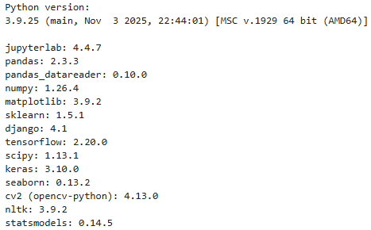

> **NOTE:** This README.md file should be placed at the **root of each of your repos directories.**
>
>Also, this file **must** use Markdown syntax, and provide project documentation as per below--otherwise, points **will** be deducted.
>

# LIS4377 Artificial Intelligence Applications

## Julia Sveen, BSIT

### Assignment 2 Requirements:

*Five Parts:*

1. Create conda environments
2. Using "Separation of Concerns" design principles
3. Examining, sorting, shaping, and analyzing data sets
4. Provide screenshots of completed app
5. Provide screenshots of completed Python skill sets

#### README.md file should include the following items:

* Screenshot of conda environments
* Link to exported conda environment package list file, [testenv.yml](testenv.yml)
* Create Python program displaying environment packages, [my_env_versions.py](my_env_versions.py)
# omg why is this not working

#### Assignment Screenshots:

*Python Environment List*:

*my_env_versions.py*:

*Screenshot of Paycheck Calculator (Jupyter Notebook)*:

##### Skillsets Screenshots:

*Screenshot of run_py_files_in_jupyter_lab.ipynb*:

*Screenshot of magic_commands.ipynb*:

