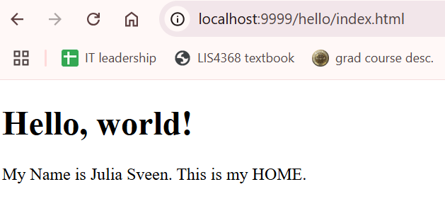
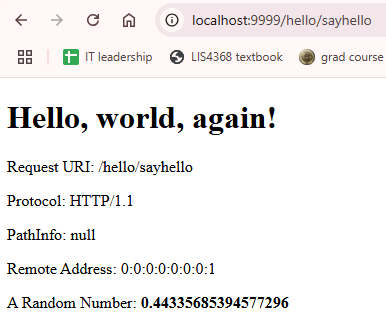
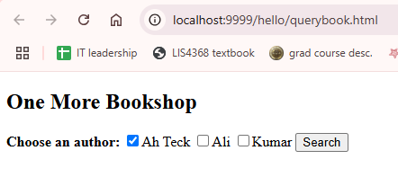
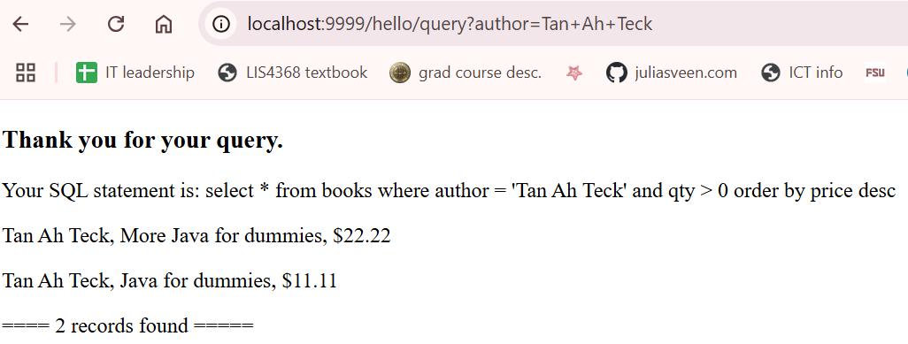
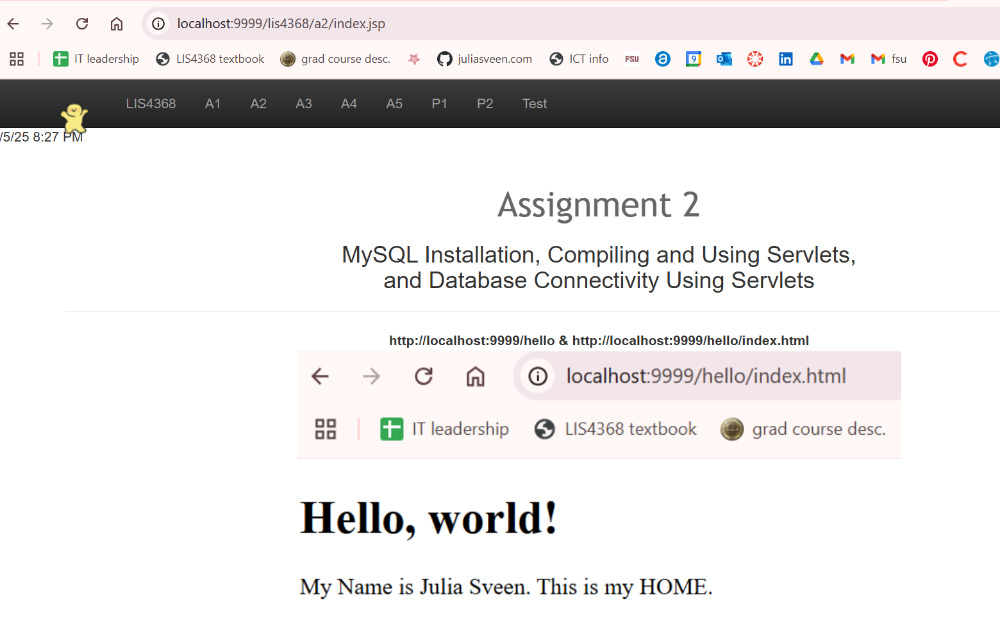

> **NOTE:** This README.md file should be placed at the **root of each of your repos directories.**
>
>Also, this file **must** use Markdown syntax, and provide project documentation as per below--otherwise, points **will** be deducted.
>

# LIS4368 [Advanced Web Application Development]

## Julia Sveen

### Assignment #2 Requirements:

*Sub-Heading:*

1. Using mySQL Workbench through AMPPS
2. Creating ebookshop database using mySQL Workbench
3. Writing a Database Servlet Deploying Servlet using @WebServlet
4. Compiling servlet files

#### README.md file should include the following items:

* Assessment links
* querybook.html SS
* Query results SS
* a2/index.jsp SS
* Skillset 1, 2, 3 SS

### Assessment links
* http://localhost:9999/hello
* http://localhost:9999/hello/index.html
* http://localhost:9999/hello/sayhello
* http://localhost:9999/hello/querybook.html
* http://localhost:9999/lis4368/a2/index.jsp

#### Assignment Screenshots:

*Screenshot of http://localhost:9999/hello & http://localhost:9999/hello/index.html*:

*Screenshot of http://localhost:9999/hello/sayhello*:

*Screenshot of http://localhost:9999/hello/querybook.html*:

*Screenshot of Query results*:

*Screenshot of a2 index.jsp*:

*Screenshot of skillset 1*:
 

*Screenshot of skillset 2*:

*Screenshot of skillset 3*:
 

