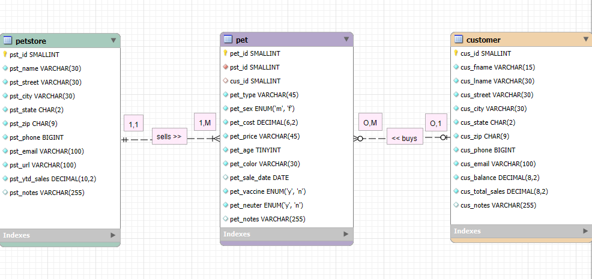
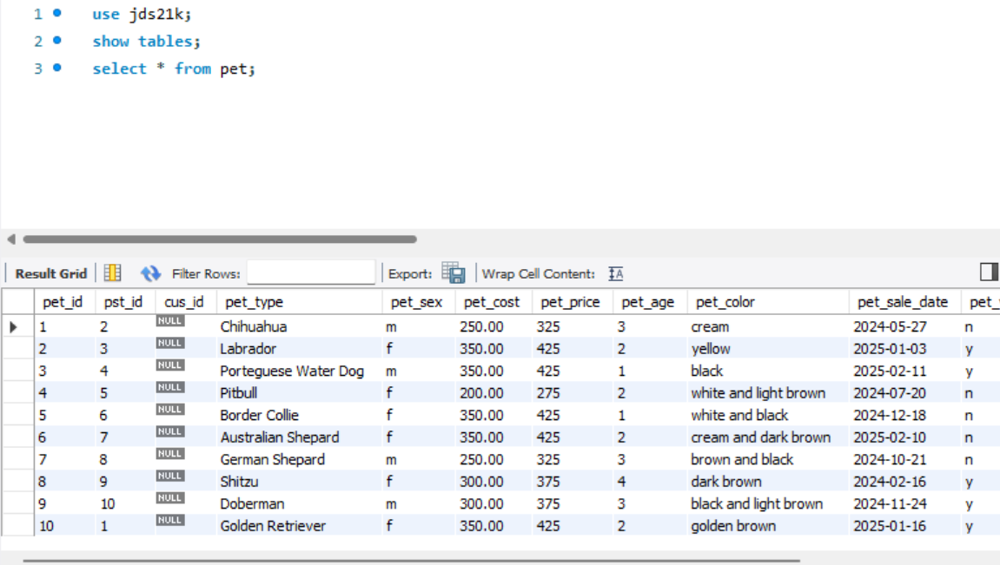
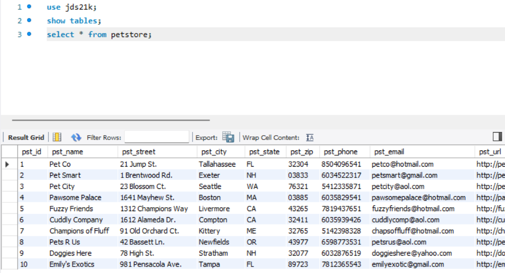
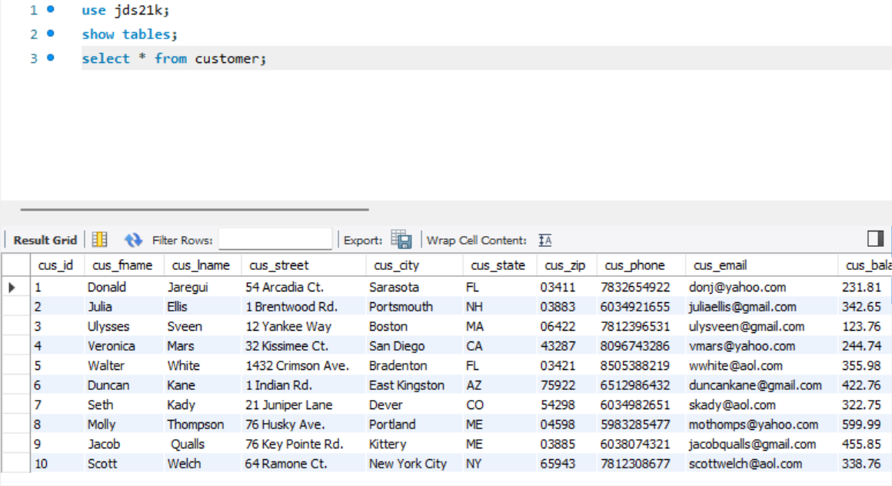
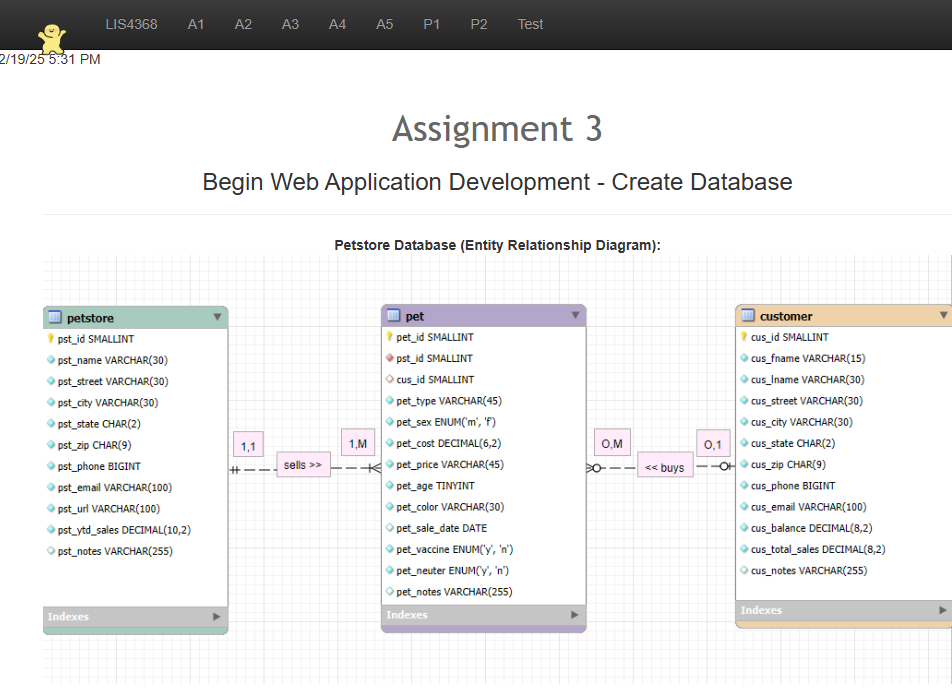
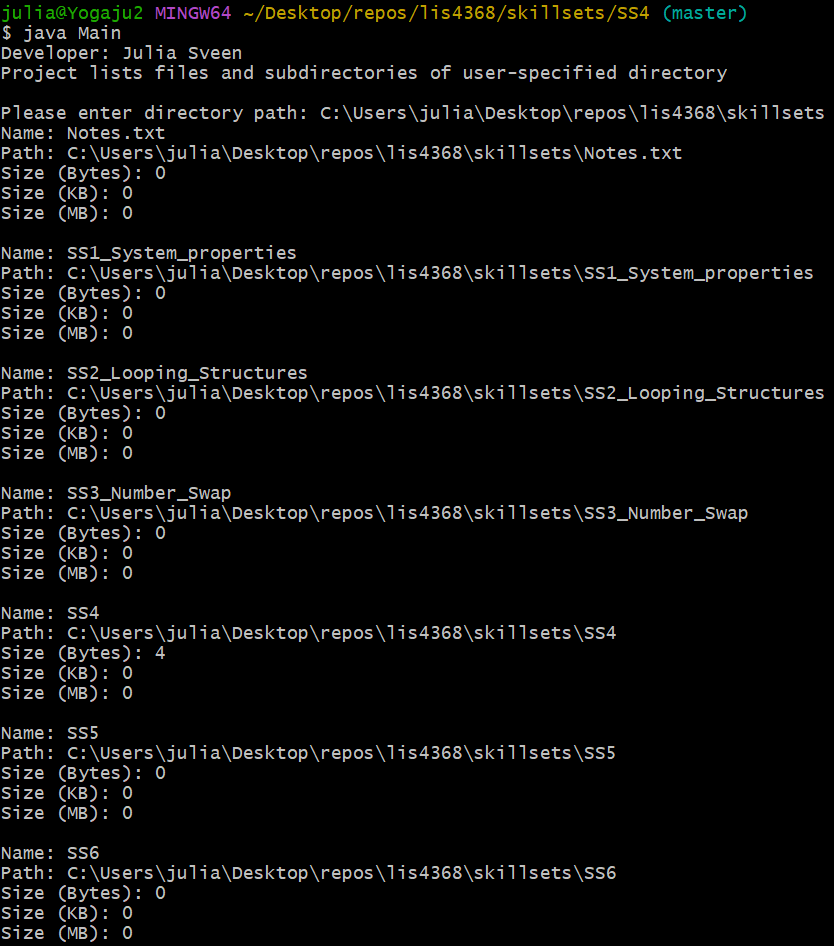
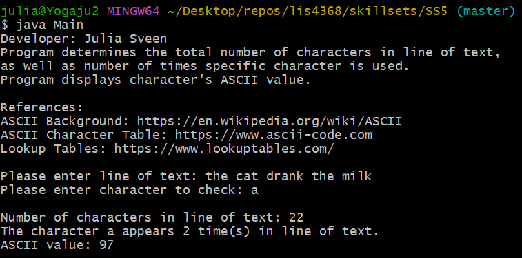
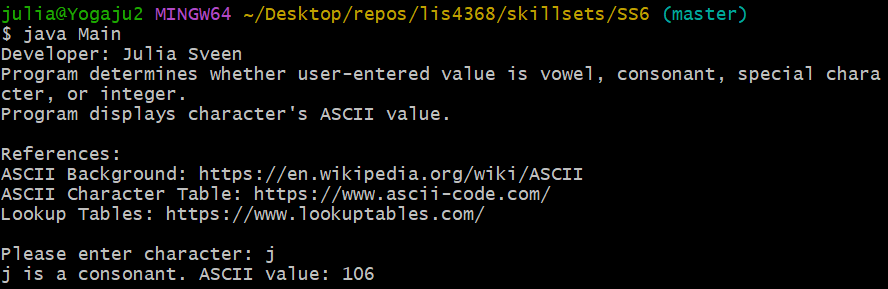

> **NOTE:** This README.md file should be placed at the **root of each of your repos directories.**
>
>Also, this file **must** use Markdown syntax, and provide project documentation as per below--otherwise, points **will** be deducted.
>

# LIS4368 Advanced Web Application Development

## Julia Sveen

### Assignment #3 Requirements:

*Deliverables*

1. Entity Relationship Diagram (ERD)
2. Include data (at least 10 records in each table)
3. Links
    * docs folder: a3.mwb, and a3.sql
    * img folder: a3.png (export a3.mwb file as a3.png)
    * README.md (must display a3.png ERD) 

#### README.md file should include the following items:

* Screenshot of a3 ERD that links to the image

#### Assignment Screenshots:

*Screenshot of A3 ERD*:

*Screenshot of Tables*:

*A3 docs: a3.mwb and a3.sql*:

[a3 mwb file](docs/a3.mwb)

[a3 sql file](docs/a3.sql)

*Screenshot of a3 index.jsp*

*Screenshot of skillsets 4, 5, 6*:

