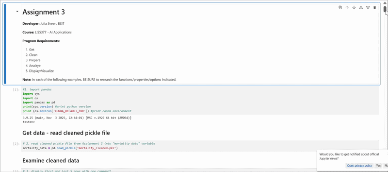

> **NOTE:** This README.md file should be placed at the **root of each of your repos directories.**
>
>Also, this file **must** use Markdown syntax, and provide project documentation as per below--otherwise, points **will** be deducted.
>

# LIS5377 Artificial Intelligence Applications

## Julia Sveen, BSIT

### Assignment 3 Requirements:

*Three Parts:*

1. Jupyter Notebook mp4 file
2. Upload A3 .ipynb file and create link in README.md
    Note: *Before* uploading .ipynb file, *be sure* to do the following actions from Kernal menu:
        a. Restart & Clear Output
        b. Restart & Run All
3. Skillsets 4, 5, 6

#### README.md file should include the following items:

* a3.ipynb
* skillsets:
    1. Skillset 4 - Lists: [main.py](../skill_sets/ss1_lists/main.py) & [functions.py](../skill_sets/ss1_lists/functions.py)
    2. Skillset 5 - Tuples: [main.py](../skill_sets/ss2_tuples/main.py) & [functions.py](../skill_sets/ss2_tuples/functions.py)
    3. Skillset 6 - Sets: [main.py](../skill_sets/ss3_sets/main.py) & [functions.py](../skill_sets/ss3_sets/functions.py)

#### Assignment Video:

*a3.ipynb*:

##### Skillset Screenshots:

*Skillset 4:*

*Skillset 5*

*Skillset 6*

