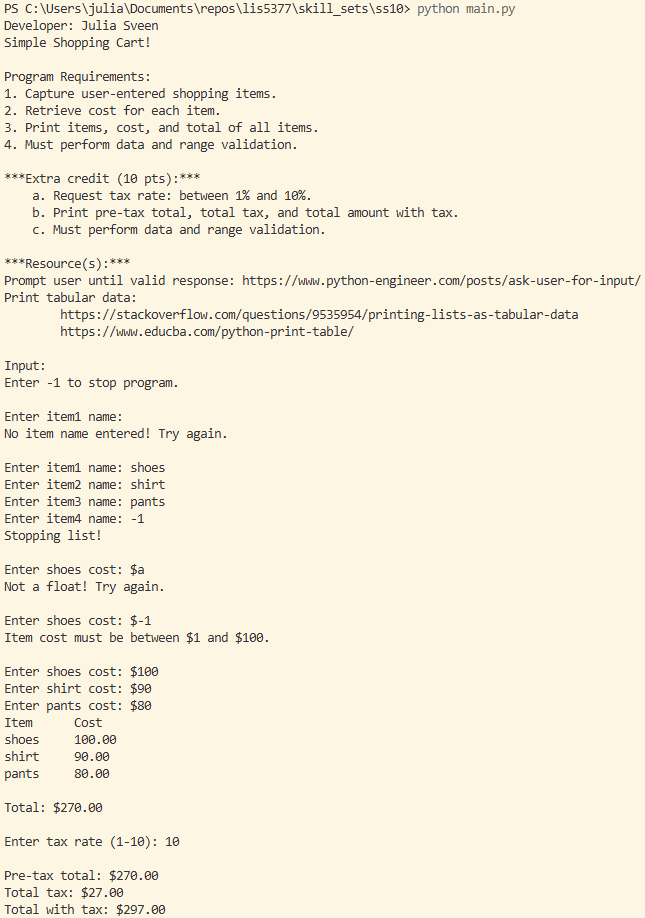
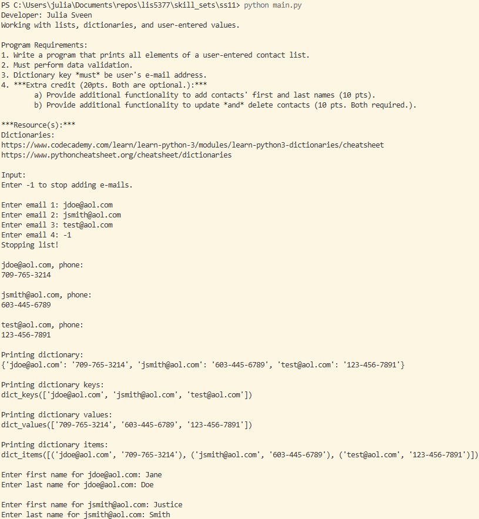
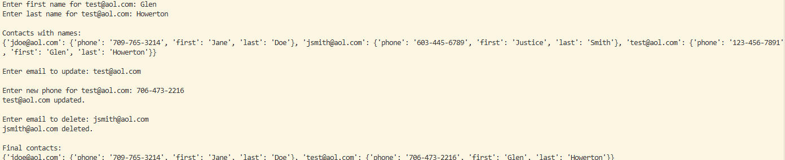
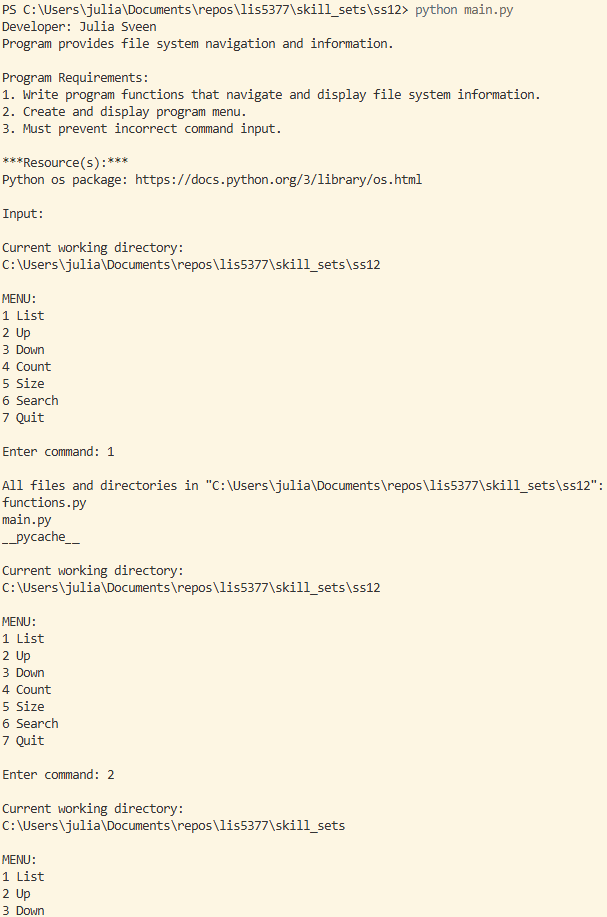
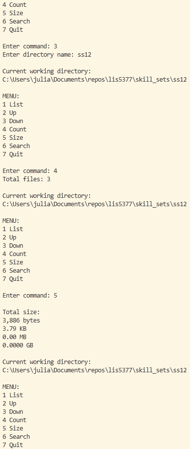
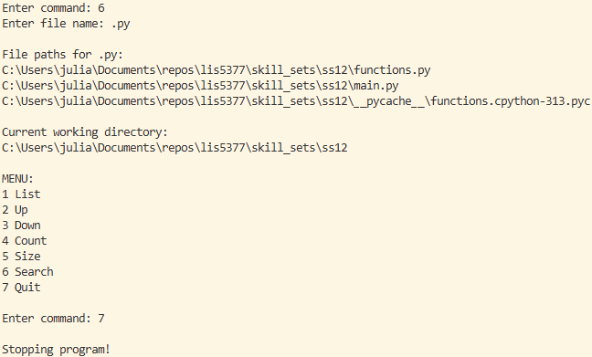

> **NOTE:** This README.md file should be placed at the **root of each of your repos directories.**
>
>Also, this file **must** use Markdown syntax, and provide project documentation as per below--otherwise, points **will** be deducted.
>

# LIS5377 Artificial Intelligence Applications

## Julia Sveen

### Assignment 4 Requirements:

*Three Parts:*

1. Jupyter Notebook gif file
2. Upload A4 .ipynb file and create link in README.md
    Note: *Before* uploading .ipynb file, *be sure* to do the following actions from Kernal menu:
        a. Restart & Clear Output
        b. Restart & Run All
3. Skillsets 10, 11, 12

#### README.md file should include the following items:

* [a4.ipynb](a4.ipynb)
* Skillsets:
    1. [Skillset 10 - Simple Shopping Cart](../skill_sets/ss10)
    2. [Skillset 11 - Lists and Dictionaries](../skill_sets/ss11)
    3. [Skillset 12 - File Information](../skill_sets/ss12)

#### Assignment 4:

*a4.ipynb*:

##### Skillset Screenshots:

*Skillset 10:*

*Skillset 11*

*Skillset 12*

