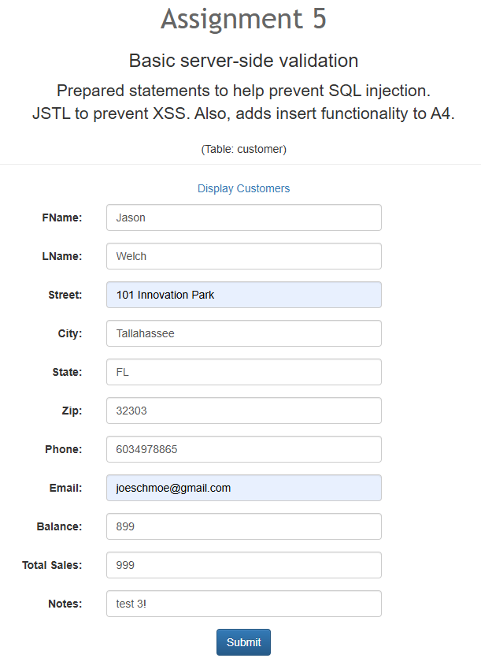
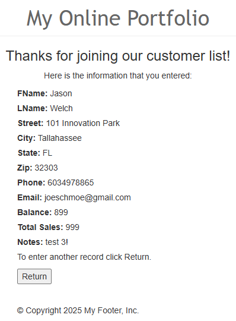
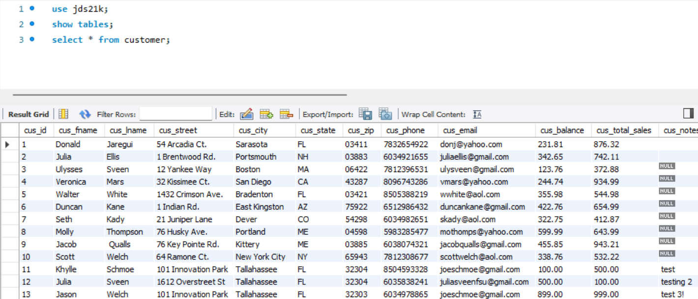
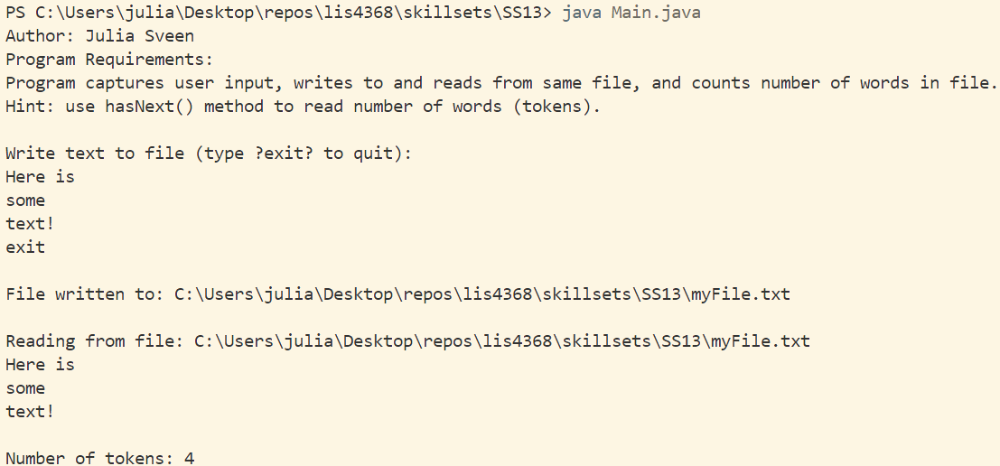
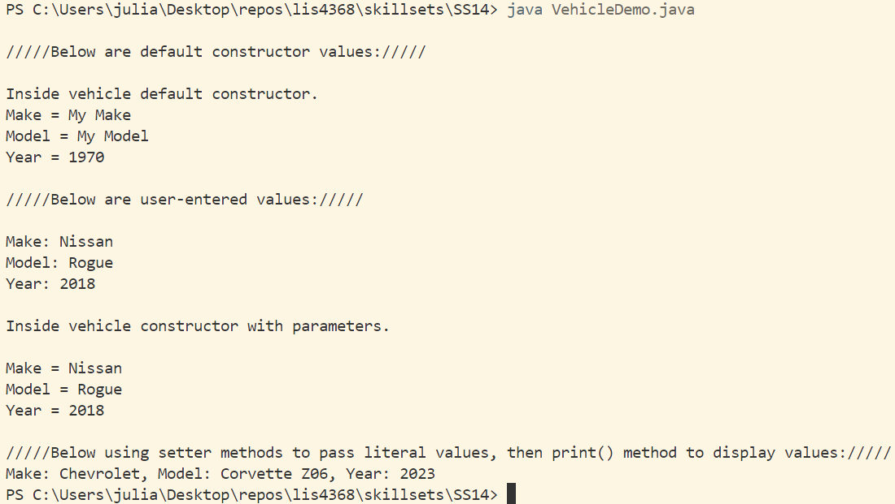
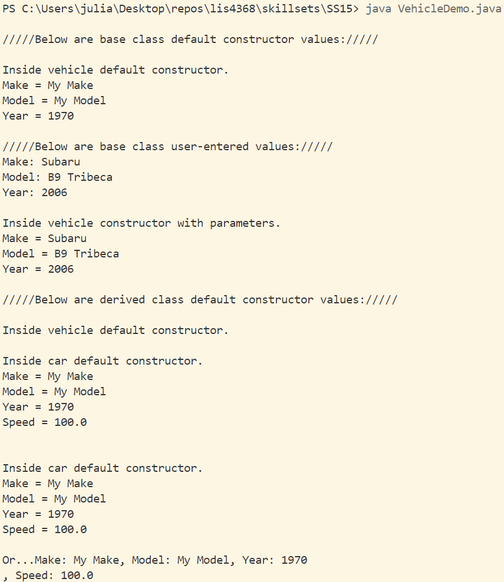
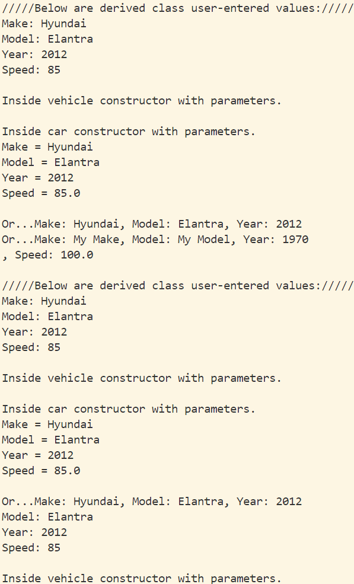
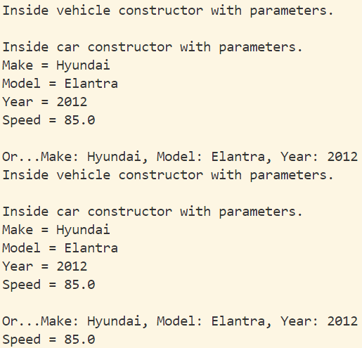

> **NOTE:** This README.md file should be placed at the **root of each of your repos directories.**
>
>Also, this file **must** use Markdown syntax, and provide project documentation as per below--otherwise, points **will** be deducted.
>

# LIS4368 Advanced Web Application Development

## Julia Sveen

### Assignment #5 Requirements:

*Deliverables*

1. MVC Framework with SQL 
2. Compiling Java Servlets
3. Skillsets 13-15
4. Chapter Questions

#### README.md file should include the following items:

* Screenshot of Valid User Form Entry (customerform.jsp)
* Screenshot of Passed Validation (thanks.jsp)
* Screenshot of Associated Database Entry
* Screenshots of Skillsets 13, 14 & 15

#### Assignment Screenshots:

*Screenshot of Valid User Form Entry (customerform.jsp)*:

*Screenshot of Passed Validation (thanks.jsp)*:

*Screenshot of Associated Database Entry*:

*Screenshot of skillset 13*:

*Screenshot of skillset 14*:

*Screenshots of skillset 15*:

