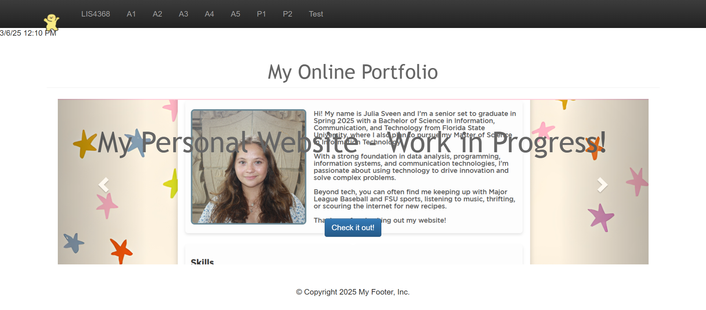
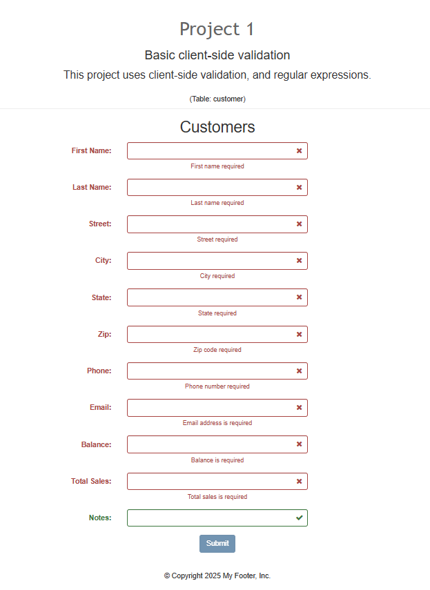
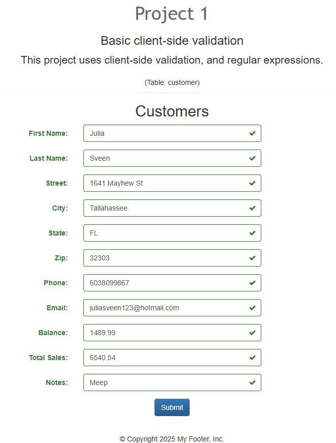
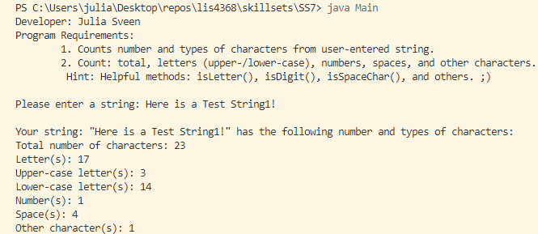
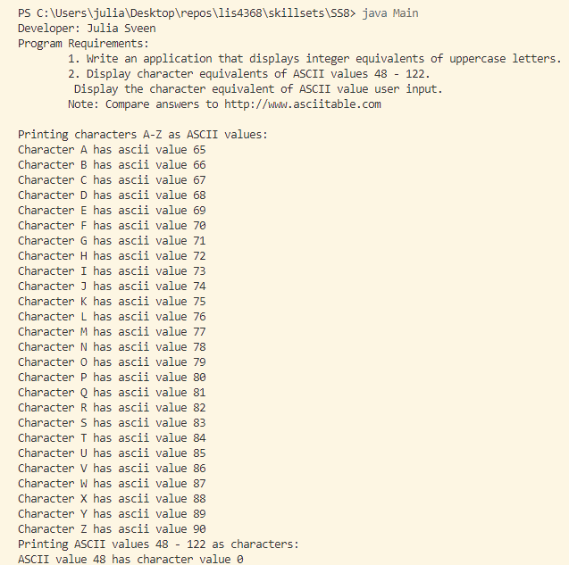
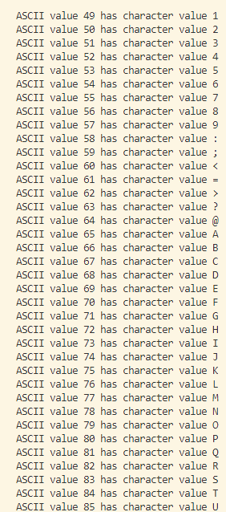
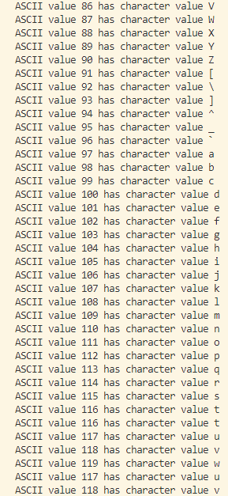
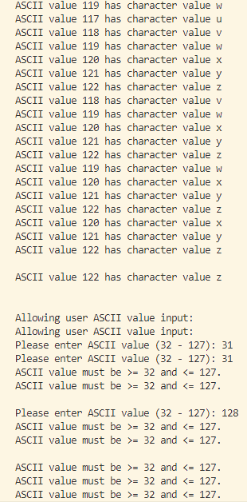
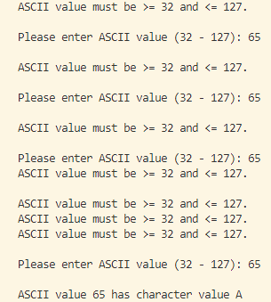
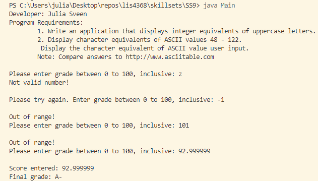

> **NOTE:** This README.md file should be placed at the **root of each of your repos directories.**
>
>Also, this file **must** use Markdown syntax, and provide project documentation as per below--otherwise, points **will** be deducted.
>

# LIS4368 Advanced Web Application Development

## Julia Sveen

### Project 1 Requirements:

*Deliverables*

1. Research of Validation Codes
2. <a href="https://bitbucket.org/jds21k/lis4368/src/master/p1/index.jsp" target="_blank">index.jsp</a>
3. LIS4368 Portal (Main/Splash Page) 
4. Skillsets 7, 8, 9

#### README.md file should include the following items:

* Research of Validation Codes
* Screenshot of LIS4368 Portal (Main/Splash Page)
* Screenshot of Failed Validation
* Screenshot of Passed Validation
* Screenshots of Skill Sets 7, 8, 9

#### Research of Validation Codes
* valid: 'fa fa-check': When the input field passes validation, it adds a green checkmark (✓) using Font Awesome’s "fa-check" icon.
* invalid: 'fa fa-times': When the input field fails validation, it adds a red "X" (✗) using Font Awesome’s "fa-times" icon.
* validating: 'fa fa-refresh': While the field is being validated, it adds a spinning loading icon using "fa-refresh" (which can indicate a validation process in progress).

#### Assignment Screenshots:

*Screenshot of LIS4368 Portal (Main/Splash Page)*:

*Screenshot of Failed Validation*:

*Screenshot of Passed Validation*:

*Screenshot of Skillset 7*:

*Screenshots of Skillset 8*:

*Screenshot of Skillset 9*:

