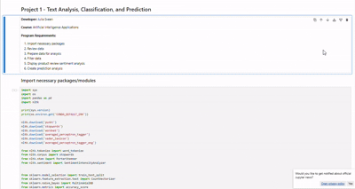
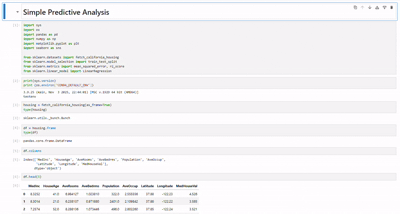
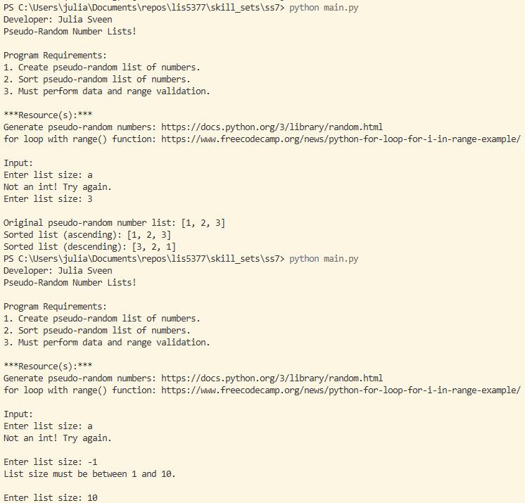
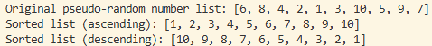
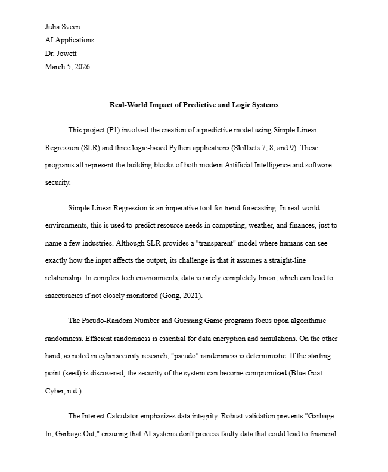
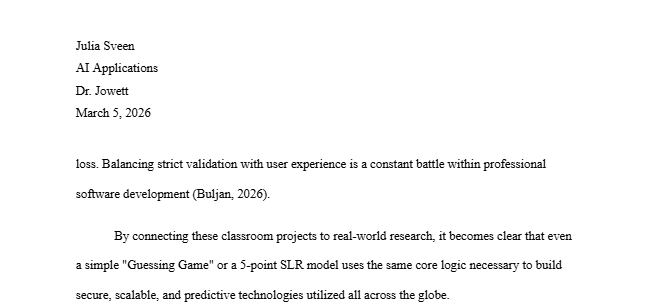
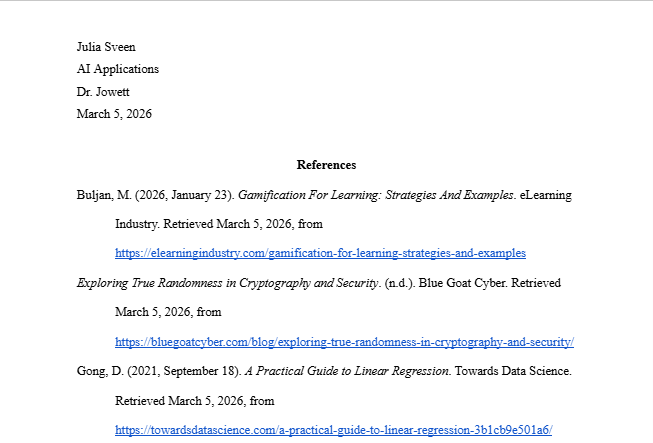

> **NOTE:** This README.md file should be placed at the **root of each of your repos directories.**
>
>Also, this file **must** use Markdown syntax, and provide project documentation as per below--otherwise, points **will** be deducted.
>

# LIS5377 Artificial Intelligence Applications

## Julia Sveen, BSIT

### Project 1 Requirements:

*4 Parts:*

1. p1.ipynb file
2. prediction_simple_jupyter_notebook.ipynb file
    Note: *Before* uploading .ipynb file, *be sure* to do the following actions from Kernal menu:
        a. Restart & Clear Output
        b. Restart & Run All
3. Skillsets 7, 8, 9
4. Graduate student report

#### README.md file should include the following items:

* [p1.ipynb](p1.ipynb)
* [prediction_simple_jupyter_notebook.ipynb](prediction_simple_jupyter_notebook.ipynb)
* Skillsets:
    1. [Skillset 7 - Pseudo-Random Numbers List (with data validation)](../skill_sets/ss7)
    2. [Skillset 8 - Interest Calculator (with data validation)](../skill_sets/ss8)
    3. [Skillset 9 - Guessing Game (with data validation)](../skill_sets/ss9)
* [Graduate student report](docs)

#### Assignment Gifs:

*p1.ipynb*:

*prediction_simple_jupyter_notebook.ipynb*:

##### Skillset Screenshots:

*Skillset 7:*

*Skillset 8*

.png)
.png)

*Skillset 9*

.png)

##### Report Screenshots:

*Report*

